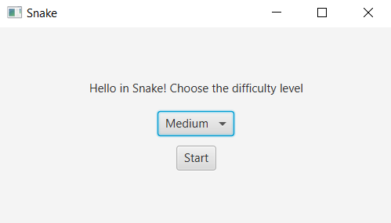
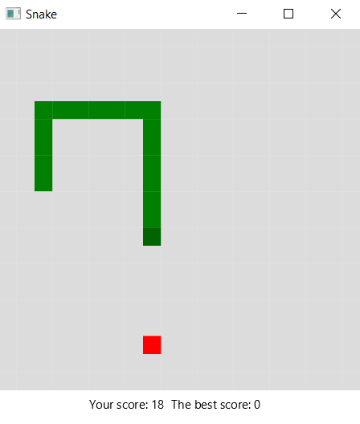
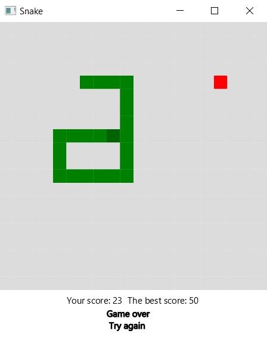
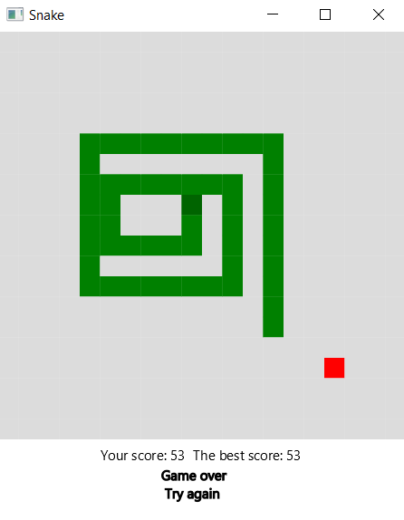

# Snake

## Project description

Snake is a project which implements basic main rules of [Snake Game](https://en.wikipedia.org/wiki/Snake_(video_game_genre)).

## Showcase

You can choose from three difficulty level (easy, medium, difficult) which differ in speed and start the game.

While playing you can keep track of your score.

When you lose, the best score will be saved and you can start the game again.

## Contributors

<table>
  <tr>
    <td align="center"><a href="https://github.com/alexmaz99"> <b>Aleksandra Mazur</b></a> </td>
  </tr>
</table>